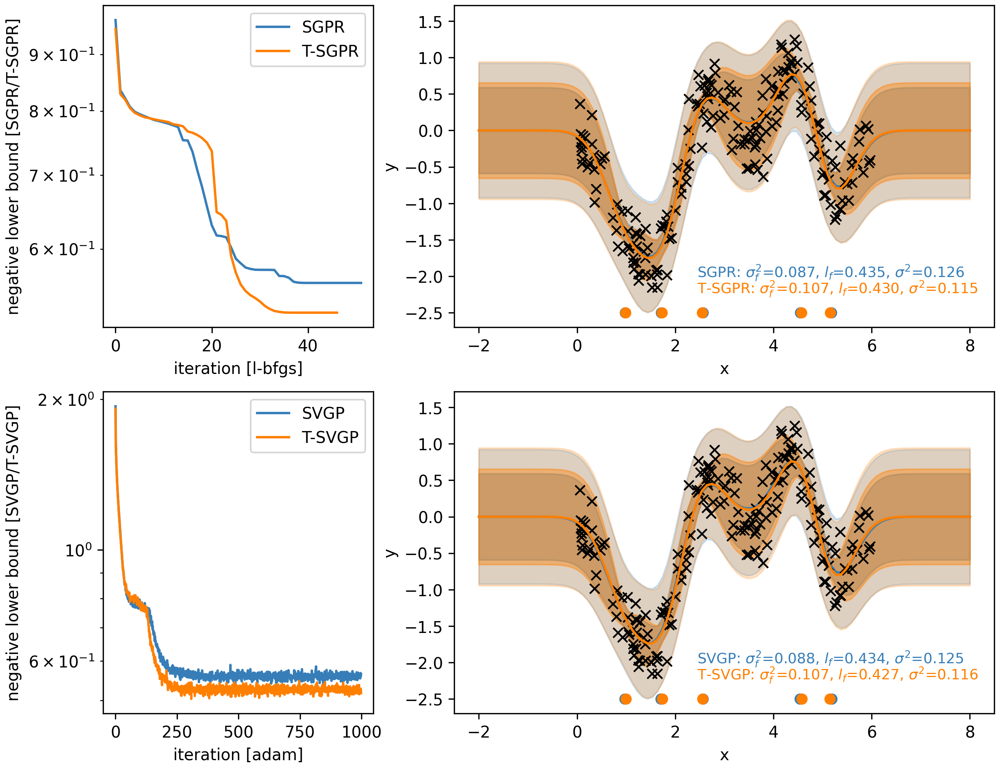

## Tighter sparse variational Gaussian processes

### Environment set-up
```bash
python3 -m venv env
source env/bin/activate
pip install -r requirements.txt
pip install -e .
```

### Example

``` bash
cd example
python run_snelson.py
```
should give:



### Citation
If you use the code here, please cite:

```latex
@article{bat2025,
    title={Tighter sparse variational Gaussian processes},
    author={Thang D.~Bui and Matthew Ashman and Richard E.~Turner},
    journal={Transactions in Machine Learning Research},
    year={2025},
    url={https://openreview.net/forum?id=L33DSu3zvq},
}
```
